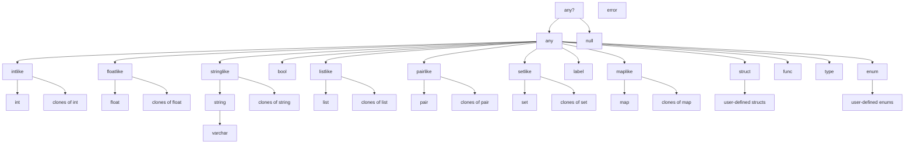

Here is a diagram of the type system. It contains a few types we haven't met yet, such as `func`.

It does *not* show the [nullable twin](https://github.com/tim-hardcastle/Pipefish/wiki/Abstract-types#nullable-twins) of each standard type, with the exception of `any?` because that would complicate the diagram to little purpose.

The `error` type is shown off to one side because it doesn't belong anywhere in the type hierarchy: not belonging is what it's for.

